# Extract, Transform, Load, the API data

## tools

- [dasel](https://daseldocs.tomwright.me/)
- [jq](https://stedolan.github.io/jq/manual/v1.6/)
- [gema](http://gema.sourceforge.net/new/index.shtml)

- [multiple address to geo coordinate](https://www.geoapify.com/tools/address-validation)
- [single address to geo coordinate](https://www.latlong.net/convert-address-to-lat-long.html)
- [Global address standardization](https://www.smarty.com/products/single-address)

## data source

- [CFM](https://tinyurl.com/communityfridges)
- [NYC](https://nycfridge.com/)

## data acceptance criteria

- address (searchable)
  - contains: house number, street, city, state, zip
  - maps to a specific geographic point
  - has geoLat, geoLng
  - pretty formatted
  - no duplicates
- fridge name
  - pretty formatted
  - sensible names for fridges from the same organization
  - no duplicates
- website link is live
- instagram link is live

## table/main fields

- mainId
- fridgeName
- fridgeTags
- fridgePhotoUrl
- fridgeNotes
- fridgeStatus: ['good', 'dirty', 'out of order', 'not at location', 'ghost']
- locationName
- locationStreet
- locationCity
- locationState
- locationZip
- locationGeoLat
- locationGeoLng
- maintainerName
- maintainerEmail
- maintainerOrganization
- maintainerPhone
- maintainerInstagram
- maintainerWebsite

## process

```mermaid

flowchart LR
%% Data Sources
subgraph "Data Sources"
A[NYC Fridge JSON]
B[CFM KML]
C[External CSVs]
end

%% Standardization
subgraph "Standardize Formats"
A --> A1[Parse & normalize JSON → array]
B --> B1[Convert KML → JSON → collect all Placemarks]
C --> C1[Convert CSV → JSON]
end

%% Extraction
subgraph "Extract Core Records"
A1 --> D1[Extract id, name, raw address, social links]
B1 --> D1
C1 --> D1
end

%% Geocoding & Validation
subgraph "Validate & Geocode"
D1 --> E1[Pull id & address → CSV → Geoapify/API]
E1 --> E2[Clean geocode results → JSON]
E2 --> E3[Flag missing house numbers → error.json]
end

%% Split into Fridge vs Location
subgraph "Split & Clean"
E2 --> F1[Extract location fields via geoapify.jq]
D1 --> F2[Extract fridge fields via fridge-*.jq]
end

%% Merge into main table
subgraph "Merge Records"
F1 & F2 --> G1[Group by id → merge fridge + location]
G1 --> G2[Append to table/main.json & re-index]
end

%% Post-processing
subgraph "Post-Processing"
G2 --> H1[Identify common words in names/streets]
H1 --> H2[Remove from search index]
G2 --> H3[Re-index main.json keys]
H3 --> H4[Run address-update geocoding]
H4 --> H5[Extract suburb/district → tags]
H5 --> I1[Final table/main.json]
end

%% Outputs
subgraph "Final Outputs"
I1 --> J1[API CSV → output/api.csv]
I1 --> J2[Google Sheets CSV]
I1 --> J3[Excel & contact-sheet merge → output/excel.csv]
end
```



### nyc fridge data

```bash
cd etl; mkdir temp output

# standardize data into a json array
jq '.fridges[]' input/nyc.json > temp/out.json
jq -s 'to_entries | map({id:(.key|tonumber), name: .value.name, address: (.value.location | .street + ", " + .city + ", " + .state + " " + .zip), instagram: .value.instagram })' temp/out.json > table/nyc.json

# address validation ---
jq '[.[] | {id,address}]' table/nyc.json | dasel -r json -w csv | tee temp/address.csv | cin
start  https://www.geoapify.com/tools/address-validation # create temp/geoapify.csv
mv 'geocoded_by_geoapify.csv' temp/geoapify.csv
dasel -f temp/geoapify.csv -r csv -w json | sed 's/original_id/id/' | jq -s '.' > table/geoapify.json

# address missing house number
jq --compact-output '.[] | .[] | {id,validation,housenumber}' table/geoapify.json | grep '"housenumber":""' > temp/error.json
# ---

# location
jq -f src/1_extract/geoapify.jq table/geoapify.json | gema -f src/1_extract/geoapify-location-invalid.pat > temp/location.json

# fridge
jq -f src/1_extract/nyc/fridge-nyc.jq table/nyc.json > temp/fridge.json

# merge fridge, location
jq -s '[ .[0] + .[1] | group_by(.id)[] | add ]' temp/{fridge,location}.json > temp/merged.json

# append merged to table/main.json and re-index
jq -n '[[inputs] | add | to_entries | .[] | . + .value | .["mainId"] = .key | del(.value,.key,.id)]' table/main.json temp/merged.json > temp/out.json
mv -f temp/out.json table/main.json

# cleanup
rm -rf temp/
```

### cfm data

```bash
cd etl; mkdir temp output

# standardize data into a json array
dasel -r xml -w json -f input/cfm.kml > temp/cfm-raw.json

rm temp/out.json
jq '.kml.Document.Folder | .[0].Placemark | .[]' temp/cfm-raw.json >> temp/out.json
jq '.kml.Document.Folder | .[1].Placemark | .[]' temp/cfm-raw.json >> temp/out.json
jq '.kml.Document.Folder | .[2].Placemark | .[]' temp/cfm-raw.json >> temp/out.json
jq '.kml.Document.Folder | .[3].Placemark | .[]' temp/cfm-raw.json >> temp/out.json
jq '.kml.Document.Folder | .[4].Placemark'       temp/cfm-raw.json >> temp/out.json
jq '.kml.Document.Folder | .[5].Placemark | .[]' temp/cfm-raw.json >> temp/out.json
jq '.kml.Document.Folder | .[6].Placemark | .[]' temp/cfm-raw.json >> temp/out.json
jq -s 'to_entries | map({id:(.key|tonumber), address: .value.address, name: .value.name, data: .value.ExtendedData.Data})' temp/out.json > table/cfm.json

# address validation ---
jq '[.[] | {id,address}]' table/cfm.json | dasel -r json -w csv | tee temp/address.csv | cin
start  https://www.geoapify.com/tools/address-validation # create temp/geoapify.csv
mv 'geocoded_by_geoapify.csv' temp/geoapify.csv
dasel -f temp/geoapify.csv -r csv -w json | sed 's/original_id/id/' | jq -s '.' > table/geoapify.json

# address missing house number
jq --compact-output '.[] | .[] | {id,validation,housenumber}' table/geoapify.json | grep '"housenumber":""' > temp/error.json
# ---

# location
jq -f src/1_extract/geoapify.jq table/geoapify.json | gema -f src/1_extract/geoapify-location-invalid.pat > temp/location.json

# fridge
jq -f src/1_extract/cfm/fridge-cfm.jq table/cfm.json > temp/fridge.json

# merge fridge, location
jq -s '[ .[0] + .[1] | group_by(.id)[] | add ]' temp/{fridge,location}.json > temp/out.json

# move data to main.json
mv -f temp/out.json table/main.json

# parity check - 103 records
grep -c '<address>' data/cfm.kml
grep -c '"id":' table/*.json
grep -c '"id":' temp/*.json

# csv from error
dasel -f data/error.json -r json -w csv | cin

# cleanup
rm temp/*
```

### identify common words to exclude fom search

```bash
node src/2_transform/api-main.mjs


jq '.fridges | .[].name' output/cfm.json | sort > temp/fridgeNames.txt
<temp/fridgeNames.txt tr -cs '[:alpha:]' '\n' | tr '[:upper:]' '[:lower:]' | sort | uniq -c | sort > temp/fridgeNamesCount.txt

jq '.fridges | .[].location.street' output/cfm.json | sort > temp/fridgeStreets.txt
<temp/fridgeStreets.txt tr -cs '[:alpha:]' '\n' | tr '[:upper:]' '[:lower:]' | sort | uniq -c | sort > temp/fridgeStreetsCount.txt
```

### re-index table/main.json

```bash
jq '[to_entries | .[] | .["mainId"] = .key | . + .value | del(.value,.key,.id)]' table/main.json > out.json
mv -f out.json table/main.json
```

### update address from table/main

```bash
jq -f src/1_extract/address-main.jq table/main.json | dasel -r json -w csv | tee temp/address.csv | cin
start  https://www.geoapify.com/tools/address-validation # create temp/geoapify.csv
mv 'geocoded_by_geoapify.csv' temp/geoapify.csv
dasel -f temp/geoapify.csv -r csv -w json | sed 's/original_id/mainId/' | jq -s '.' > table/geoapify.json

#  location
jq -f src/1_extract/geoapify.jq table/geoapify.json | gema -f src/1_extract/geoapify-location-invalid.pat > temp/location.json

jq -s '[ .[0] + .[1] | group_by(.mainId)[] | add ]'  table/main.json temp/location.json > temp/out.json
cdiff temp/out.json table/main.json
```

### tags (suburb, district) from table/main

```bash
jq '[.[] | .mainId as $id | {suburb, district} | {mainId:($id|tonumber), fridgeTags: [.[]]}]' table/geoapify.json > temp/tag-location.json
jq -s '[ .[0] + .[1] | group_by(.mainId)[] | add ]' table/main.json temp/tag-location.json > temp/out.json
mv -f temp/out.json table/main.json
```

### create google sheet from API.json

```bash
mkdir temp
jq -f src/2_transform/main-api.jq output/api.json | sed 's/null/""/' | dasel -r json -w csv > temp/api.csv
```

### merge random table into main.json using address as key

- convert to json and create id

```bash
mkdir temp; rm temp/*

mv 'file.csv' temp/excel.csv
dasel -r csv -w json -f temp/excel.csv > temp/excel.json
jq -sf src/1_extract/excel/table-contactSheet.jq temp/excel.json > table/excel.json
jq -sf src/1_extract/excel/table-masterlist.jq temp/excel.json > table/excel.json
```

- create location key

```bash
jq '[.[] | {id,address}]' table/excel.json | dasel -r json -w csv | tee temp/address.csv | cin
start https://www.geoapify.com/tools/address-validation # create temp/geoapify.csv
mv 'geocoded_by_geoapify.csv' temp/geoapify.csv
dasel -f temp/geoapify.csv -r csv -w json | sed 's/original_//' | jq -s '.' > table/geoapify.json
jq -f src/1_extract/geoapify.jq table/geoapify.json | gema -f src/1_extract/geoapify-location-invalid.pat > temp/location.json
```

- merge location data into excel table

```bash
jq -s '[ .[0] + .[1] | group_by(.id)[] | add ]' {table/excel,temp/location}.json > temp/merged.json
mv -f temp/merged.json table/excel.json
```

- align the excel table with the table/main.json

```bash
node src/2_transform/align-keys.mjs &> ~/scratch.txt
jq -s '[ .[0] + .[1] | group_by(.id)[] | add ]'  temp/out.json table/excelMain.json > temp/merged.json
<temp/merged.json tr -d '\r' > table/excelMain.json
```

- create the CSV file for Google import

```bash
dasel -r json -w csv -f table/excelMain.json > output/excel.csv
```
